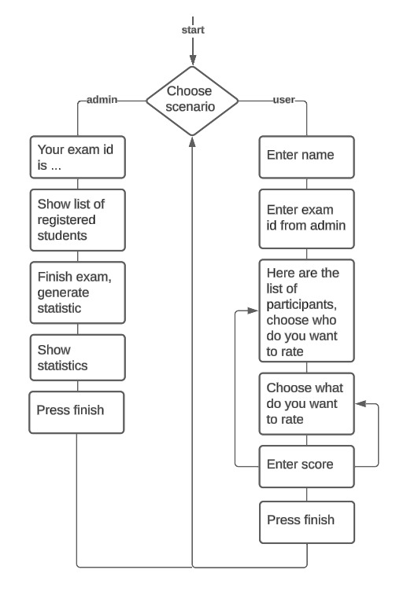
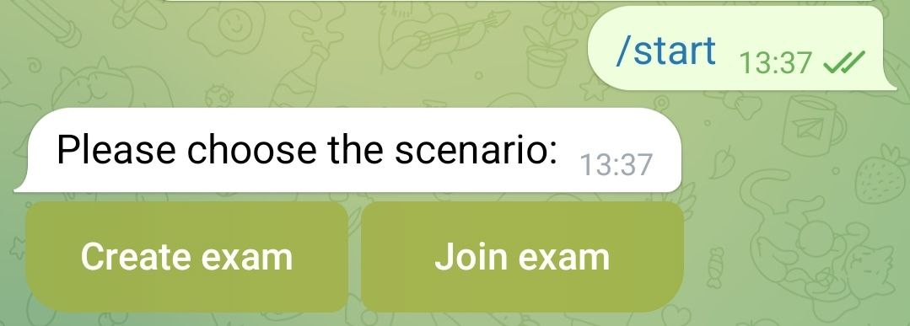
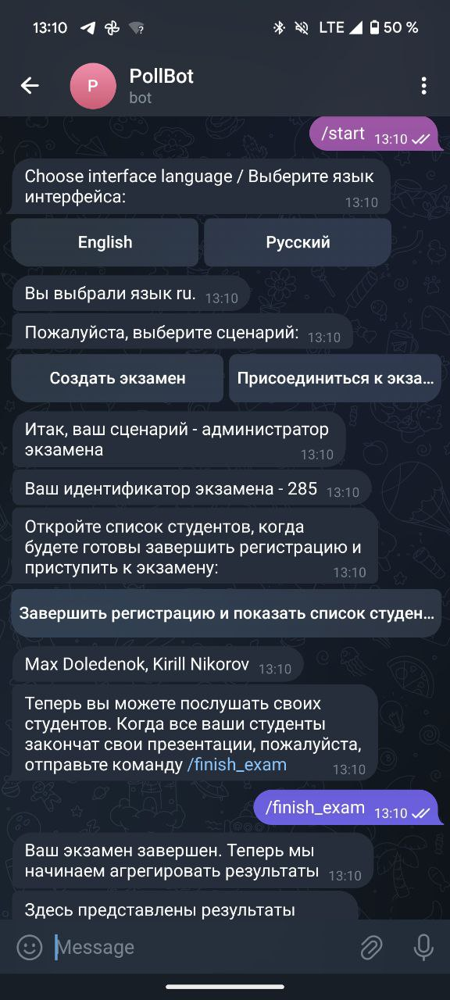
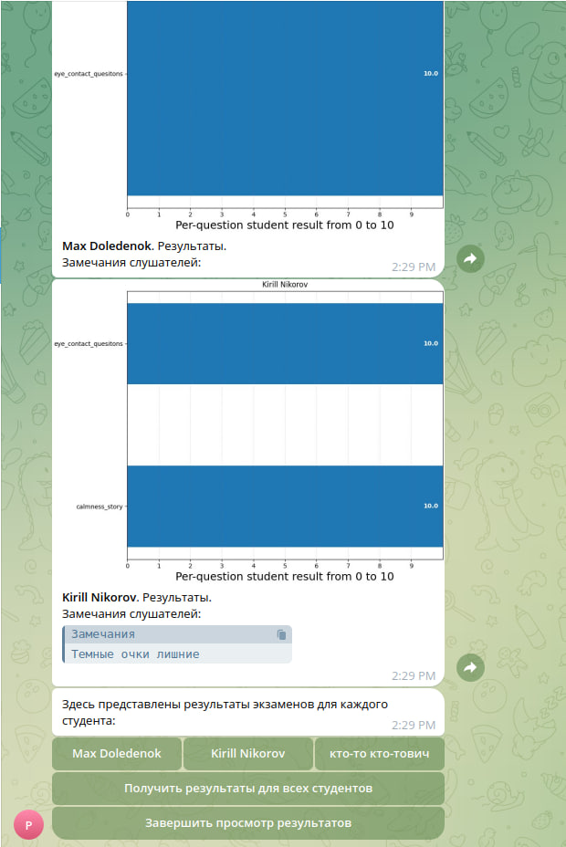

# Бот для оценки выступлений

## Задача

Реализовать систему опроса слушателей во время проведения экзамена в кружке ораторского мастерства.
Слушатели будут оценивать выступающих по различным критериям.
Оценки собираются, и в конце экзамена выдается статистика, как общая, так и для всех выступащих по отдельности.

## Реализация

Проект представляет собой телеграм-бота, написанного на языке Python с помощью библиотеки python-telegram-bot.

## Функционал

Приблизительный сценарий работы бота:

## Интерфейса

Бот имеет текстовый интерфейс и взаимодействует с пользователем через Telegram.

### Примеры интерфейса:

Стартовый выбор сценария

Проведение экзамена

Просмотр результатов экзамена

